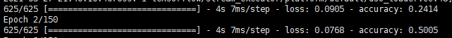
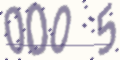
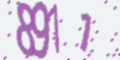

# captcha_tf2 
验证码识别 深度学习 tensorflow 神经网络<br> 
使用卷积神经网络，对字符，数字类型验证码进行识别，`tensorflow`使用`2.0`以上<br>
<br>
目前项目还在更新中,诸多bug，欢迎提出issue和PR, 希望和你一起共同完善项目。

# 实例demo
## 训练过程
* 优化器选择: Adam
* 损失函数: MSLE(均方对数误差)<br>
* 数据集: 随机生成的10000张图片，按照8:2用于训练和验证<br>
* 设备: Titan X
在训练过程中第5次epoch即可达到 `80的accuracy`，`50以上的val_accuracy`。<br>
经过30次epoch `accuracy达到93`, val_acc在`85`以上<br>
最高达到97 acc

> 目前训练val提升可以，loss下降稳定<br>
>> <br>
> demo图片<br>
>>  <br><br> 
>>   <br>
>>  
 
# 目录
## 1. 项目结构
> 1.1 文件目录
>> |序号 | 文件| 说明|
>> | ----- | ----- | -----|
>> | 1 | model/ | 模型权重文件| 
>>| 2 | network/ | 神经网络|
>> | 3 | settings_tf | 项目配置文件|
>> | 4 | tools/ | 工具文件 |
>> | 5 | data/ | 数据文件|

> 1.2 主要文件
>> | 序号 | 文件 | 说明|
>> |------|------|-----|
>> | 1 | train.py | 训练程序 |
>> | 2 | detect.py | 测试程序 |
>> | 3 | make_data.py | 训练集合成程序|
>> | 4 | create_image.py | 数据集生产脚本|

## 2. 使用
修改主路径下derect.py的配置变量`注:注意config.py的图片size`<br>
直接调用```python detcet.py```<br>
保存格式:*.txt: ```[6, 9, 5, 6]    1.jpg``` 

## 3. 训练
#### 3.1 数据准备:
* 如果自己收集数据较为繁琐，可直接调用```create_image.py```,修改相应配置即可快速生成图片集和标注文件
无需其他步骤
* 或是自己去网络上寻找验证码图片集, 保存格式需以数字顺序保存，且标注文件存放在某个单独的 
txt中，标注结果是对应的图片名数字-1作为下标 `默认采用数据集样式为1.jpg, 2.jpg ...的顺序格式`<br>
```
|￣￣data/
|   |
|   |￣￣images/
|   |   |
|   |   |￣￣1.jpg
|   |   |
|   |   |￣￣2.jpg
|   |    
|   |￣￣label.txt
```
### 3.2开始训练
首先修改`congig.py`配置文件<br>
接着修改`train.py`<br>
* 开始训练 ``python train.py``<br>


# 网络
| 序号  |   层  |
| :----:  |:-----:|
| 输入  |(B, 60, 160, 1)
| 1     |卷积(32)   relu   BN|
| 2     |卷积(64)   relu   BN  相等池化|
| 3     |卷积(128)  relu   BN  相等池化|
| 4     |卷积(64)   relu   BN  相等池化|
| 5     |卷积(32)   relu   BN  相等池化|
| 6     |     扁平化|
| 7     | 全连接(100) relu|
| 8     | 全链接(onehot)  softmax|
| 输出   | (长度, 类别)| 